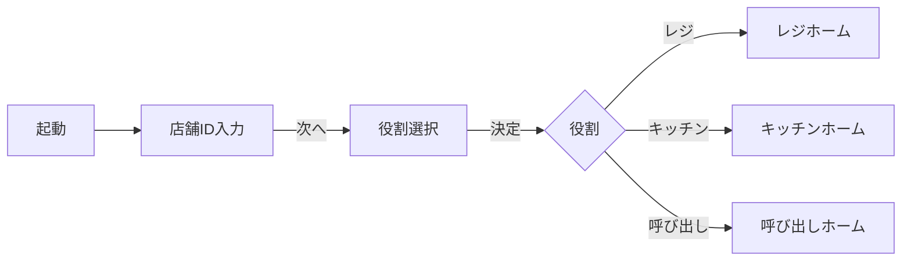
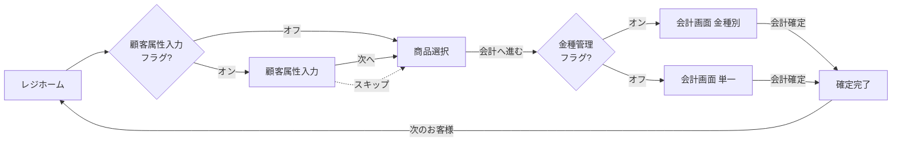
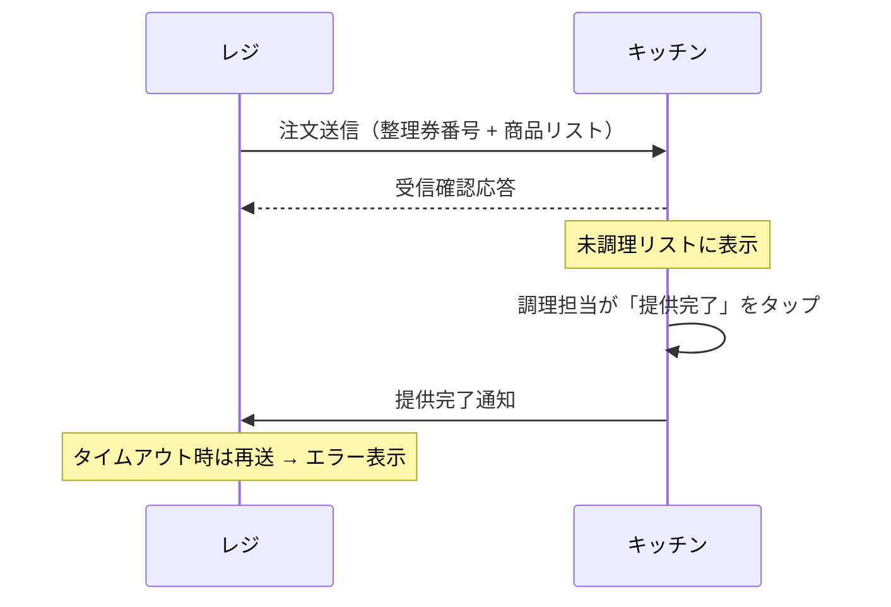
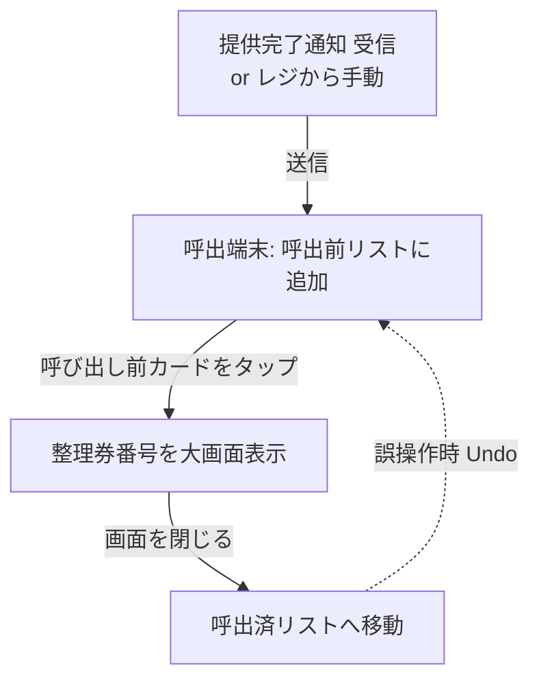
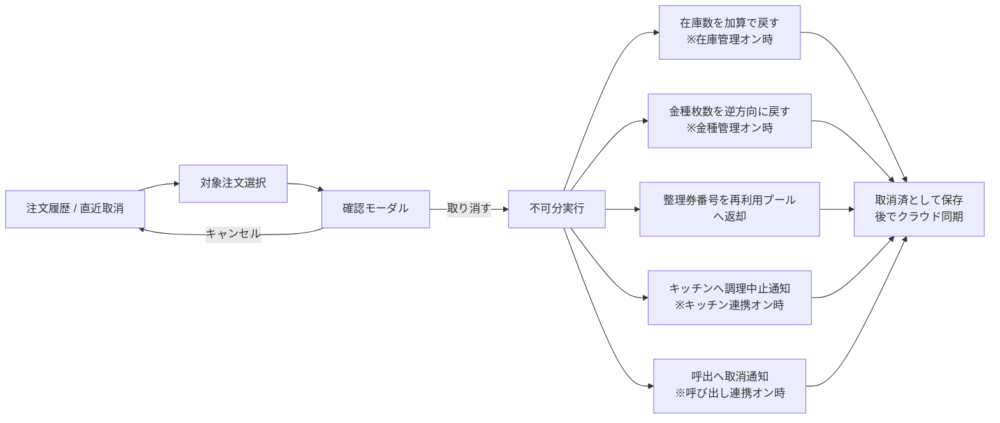
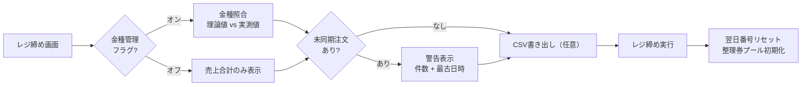
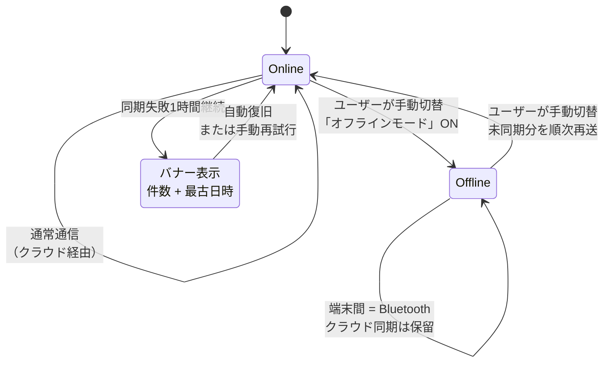

# 仕様書: 学祭向けオフラインPOSシステム

## 1. システム概要

学園祭の模擬店での利用を想定した、オンライン接続を前提としつつ、オフライン環境でも継続稼働するPOS（販売時点情報管理）システム。

### 1.1. 目的

- **会計業務の効率化**: 模擬店での注文受付・会計・整理券発行を一元化する。
- **店舗内連携**: レジ・キッチン・呼び出し担当の端末を、通常はインターネット経由で連携させ、回線障害時もBluetoothで連携を継続させる。
- **売上分析**: 売上データをクラウドに集約し、来客傾向や商品別売上を分析可能にする。

### 1.2. 設計の原則

| 原則 | 内容 |
|---|---|
| ローカル正本・クラウド同期 | 全ての業務データ（商品マスタ、注文、注文明細、金種在庫、キッチン/呼び出し用注文、設定）はまず端末ローカルに保存される。クラウドは同期先・集約先であって、業務継続の必要条件ではない。 |
| オンライン優先・オフライン継続 | 通常はインターネット経由で端末間連携と売上集約を行う。ネットワーク障害時は近距離無線通信（Bluetooth）に自動でフォールバックし、業務を止めない。 |
| データ厳格性 | 一度確定された会計データは、いかなる障害（端末間通信失敗、クラウド同期失敗、アプリ異常終了）が起きても失われない。 |
| 緊急度に応じた送達保証 | 業務継続に直結する情報（注文・提供完了など）は送達確認を必須とし、失敗時は送信側に明示エラーを出す。緊急度の低い情報（商品マスタ等）は失敗時に静かに再試行する。 |
| モジュール性 | 主要機能はオン/オフ切り替え可能とし、店舗の運用形態に合わせて構成できる。 |

---

## 2. 端末の役割

1台のアプリは、起動時に選択された役割に応じて以下のいずれかとして動作する。

| 役割 | 主な担当 | 配置想定 |
|---|---|---|
| **レジ** | 顧客対応・会計・整理券発行 | 注文窓口に **1店舗あたり1台**（単一レジ前提） |
| **キッチン** | 調理対象注文の表示・提供完了報告 | 調理場に1台 |
| **呼び出し** | 整理券番号の呼び出し表示 | 受け渡し窓口に1台 |

レジは1店舗1台運用を前提とする。これにより整理券番号プールの一元管理、商品マスタ・在庫・金種在庫の編集競合が原理的に発生しない構成とする。

「キッチン」「呼び出し」の役割は、後述の機能フラグでオフにすれば不要となり、レジ単独運用も可能。

---

## 3. 初期設定（起動時）

アプリを初めて起動した端末は、以下の順で設定を行う。設定済みの場合はスキップする。

1. **店舗IDの入力**: 同一店舗の端末群を識別する任意の文字列（例: `yakisoba_A`）。同店舗の端末はすべて同一の店舗IDを共有する。
2. **役割の選択**: レジ／キッチン／呼び出しのいずれかを選ぶ。
3. **ホーム画面の表示**: 選んだ役割のホーム画面に遷移する。

役割と店舗IDは端末内に永続化され、再起動時には自動で復元される。

---

## 4. 機能フラグ（オン/オフ切替機能）

レジ端末の「設定」画面から、以下の機能を個別にオン/オフできる。すべて初期状態は **オフ**。各フラグは互いに独立しており、任意の組み合わせで運用できる。

| 機能フラグ | 説明 |
|---|---|
| 在庫管理 | 商品ごとの在庫数を管理する。在庫切れ商品は注文画面で選択不可になる。 |
| 金種管理 | レジ内の金種別枚数（理論値）を管理し、レジ締め時に実測値と照合できる。 |
| 顧客属性入力 | 会計前に顧客の年代・性別・客層を記録する。売上分析に利用される。 |
| キッチン連携 | レジで確定した注文をキッチン端末へ自動送信し、キッチンからの提供完了通知をレジで受け取る。 |
| 呼び出し連携 | 呼び出し端末を表示用ディスプレイとして連携させ、整理券番号を表示する。 |

**全フラグオフ時でも、商品選択 → 会計 → 確定 → クラウド同期 までのレジ単独業務は利用可能**。

「キッチン連携」と「呼び出し連携」は独立したフラグであり、片方だけをオンにしてもよい。
- 両方オン: キッチンの「提供完了」が呼び出し端末への番号表示を自動でトリガーする。
- キッチン連携のみオン: レジが提供完了通知を受け取って画面に表示するが、顧客への呼び出しは口頭等で行う。
- 呼び出し連携のみオン: レジ画面の各注文に「呼び出す」ボタンを設け、レジ担当の手動操作で呼び出し端末に番号を表示する。
- 両方オフ: 端末間連携は行わない。

---

## 5. データの構成

全ての業務データは、まず端末ローカルストレージに保存される。クラウド・他端末への送信は、ローカル保存が完了した後に副次的に行うものとする。各端末がローカルに保持する情報は次のとおり。

### 5.1. 商品マスタ（全端末が保持）

| 項目 | 説明 |
|---|---|
| 商品ID | 商品を一意に識別する値 |
| 商品名 | 表示名 |
| 価格 | 円単位の販売価格 |
| 在庫数 | 残数（在庫管理がオフのときは無視） |
| 表示色 | 商品ボタンの背景色（任意。未指定時はテーマ既定色） |
| 削除フラグ | 廃止商品の論理削除に使用 |

### 5.2. 注文（レジ端末が保持）

| 項目 | 説明 |
|---|---|
| 注文ID | システム内部の永続的な連番（DB主キー）。再利用されない |
| 整理券番号 | 顧客への引換番号。後述の循環方式で発番・再利用される |
| 顧客属性 | 年代・性別・客層（顧客属性入力がオンの場合のみ） |
| 合計金額 | 割引適用前の金額 |
| 割引・割増額 | プラス/マイナスの調整額（負の値で割引） |
| 請求金額 | 顧客に請求する最終金額（= 合計金額 + 割引・割増額） |
| 預り金 | 受け取った現金額 |
| お釣り | 返却した現金額（= 預り金 − 請求金額） |
| 注文日時 | 確定時刻 |
| 注文ステータス | 未送信／送信済／提供済／取消済 |
| 同期ステータス | 未同期／同期済（クラウド同期用） |

#### 整理券番号の発番ルール

整理券番号は、注文IDとは別に、**顧客に提示するための短い循環番号**として運用する。レジは単一台運用のため、番号プールはレジ端末ローカルで一元管理する。

- 1〜N（既定: 1〜99）の範囲を循環使用する。範囲はレジ設定で変更可能とする。
- 番号は使用中（未送信／送信済）の注文に重複して割り当ててはならない。
- 「提供済」または「取消済」となった番号は、即時に再利用せず、**一定数（既定: 10件）の他注文が経過するまでバッファ**としてプールに留め置く。バッファ経過後、未使用の最若番から再利用する。
- 範囲内に空き番号が存在しない場合は、新規会計確定をブロックし、レジ画面に警告を出す。
- **営業日の切替**: 日付（端末ローカル時刻の日替わり）をもって整理券番号は1から振り直される。前日分の使用済番号はすべてプールに返却された上で、新営業日のプールが初期化される。

### 5.3. 注文明細（レジ端末が保持）

注文に含まれる商品ごとに「注文ID・商品ID・数量・販売時単価」を持つ。商品マスタの価格変更があっても、注文時の単価が保たれる。

### 5.4. 金種在庫（レジ端末のみ。金種管理オン時のみ使用）

1円・5円・10円・50円・100円・500円・1,000円・5,000円・10,000円のそれぞれについて、現在の枚数（理論値）を保持する。

### 5.5. キッチン用注文（キッチン端末のみ。キッチン連携オン時のみ使用）

整理券番号・注文内容（商品名と数量のリスト）・調理ステータス（未調理／提供完了）を保持する。

### 5.6. 呼び出し用注文（呼び出し端末のみ。呼び出し連携オン時のみ使用）

整理券番号・呼び出しステータス（呼び出し前／呼び出し済み）を保持する。

---

## 6. 業務フロー

### 6.1. レジでの会計

1. **顧客属性入力**（オン時のみ）: 年代・性別・客層を選択。
2. **商品選択**: 商品マスタから注文する商品と数量を入力する。在庫管理がオンの場合、在庫数を超えた数量は入力できないようにし、残り在庫が0の商品は選択不可とする。
3. **会計**: 合計金額・割引/割増・預り金を入力し、お釣りを表示する。割引/割増は金額（円）または率（％）のいずれかで入力し、適用後の金額をリアルタイムにプレビュー表示する。金種管理がオンなら、金種別の入出金を入力する。
4. **会計確定**: 整理券番号が発番される。以下を **ひとつの不可分な単位** として端末内に保存する。
   - 注文・注文明細の登録
   - 在庫数の減算（在庫管理オン時）
   - 金種枚数の更新（金種管理オン時）
5. **注文の連携**: 端末内保存が完了した後にのみ、キッチン端末への注文送信を行う（キッチン連携オン時）。送信失敗・確認応答なしの場合は、レジ画面に明示的なエラーを表示する。

会計データは、いかなる連携の失敗が発生しても、端末内には確実に残る。

### 6.2. キッチンでの調理対応

1. レジから受信した注文が、未調理の状態でキッチン画面に一覧表示される。
2. 調理担当が「提供完了」を押すと、当該注文は提供完了状態に更新され、レジ端末へ完了が通知される。

### 6.3. 呼び出し

呼び出し端末は、レジ端末から受信した整理券番号を表示する独立した表示器として動作する。呼び出し連携がオンの場合のみ機能する。

呼び出し端末への番号送信のトリガーは、キッチン連携の有無で切り替わる:
- **キッチン連携オン**: キッチンから「提供完了」が届いたタイミングでレジが自動転送する。
- **キッチン連携オフ**: レジ画面の各注文に表示される「呼び出す」ボタンを、レジ担当が手動で押下することで送信する。

呼び出し端末側の挙動:
1. 「呼び出し前」「呼び出し済み」の2リストを画面上で同時に表示する。
2. 呼び出し前の注文をタップすると整理券番号が大画面表示され、閉じると当該注文は呼び出し済みに移る。

### 6.4. レジ締めと営業日の区切り

営業終了時、レジ締め画面を表示する。
- 金種管理オン時: 金種別の理論値と実測値を並べ、差額を確認できる。
- 金種管理オフ時: 売上合計のみを表示する。
- 未同期の注文が残っている場合は、レジ締め画面に警告を出し、件数と最古の未同期日時を表示する（8.2参照）。

**営業日の区切り**は、端末ローカル時刻の **日付（カレンダー日）** をもって行う。日付が変わったタイミングで以下を実施する。
- 整理券番号プールを初期化し、新営業日の番号を1から振り出す。
- キッチン画面の履歴上限（9.4）の経過時間カウントは前日のものをリセットしてよい。
- 売上集計は日付単位で区切られ、レジ締め画面・クラウド集計シートで日別集計が可能となる。
- 商品マスタ・金種在庫・機能フラグなどの設定情報は日付をまたいで持ち越される（リセットされない）。

### 6.5. 商品マスタの編集と同期

レジ端末では、商品の追加・編集・削除（論理削除）・表示色の変更を行えるものとする。営業中の編集も許容する。

商品マスタを変更した場合、変更後ただちに、および各キッチン端末への接続時に、最新の商品マスタ全件をキッチン端末へ送信する。商品マスタは緊急度の低い情報として扱い、送信失敗時は静かに再試行する（7章参照）。

### 6.6. 注文の取り消し・返金

会計確定後の注文を取り消す手段を提供する。誤会計・顧客都合によるキャンセル等に対応する。

操作の入口:
- 直近の注文に対する取り消しは、レジ画面から1〜2タップで行えること。
- 過去の注文に対しては、注文履歴画面から対象を選んで取り消せること。

取り消し時の処理（不可分単位で実行）:
1. 注文ステータスを「取消済」に更新する。取り消し操作は履歴として残し、後から監査できる形で保持する（誰がいつ取り消したかの記録は本仕様の範囲外、アプリ側で簡易な操作ログを保持）。
2. 在庫管理がオンなら、当該注文で減算した在庫数を加算で戻す。
3. 金種管理がオンなら、預り・お釣りで動かした金種枚数を逆方向に戻す（＝返金分の現金移動を反映）。
4. 整理券番号を再利用プールへ返却する（バッファ経過後に再利用可能）。
5. キッチン連携がオンなら、キッチン端末へ「**調理中止**」通知を送信する。受信側は当該注文を未調理リストから除き、調理中／調理完了済の場合は調理担当に向けて目立つ警告（例: 赤背景＋アラート音）を表示する。
6. 呼び出し連携がオンなら、呼び出し端末へ取消通知を送信する。呼び出し前リストから当該注文を除き、大画面表示中であれば即座に閉じる。

権限制御:
- 取り消し操作にロック等の認証は設けない。**履歴に残ることによる信用ベースの制御**とする。誰がいつ取り消したかを後から振り返れるよう、操作ログは消去できないものとする。

クラウド同期:
- 取消済の注文は、クラウド側の集計シートにも取消行として送信する（売上元帳上では赤字や取消フラグで識別できる形を想定）。
- 同期前に取り消された注文は、未同期のまま「取消済」として送信され、クラウド側で正しく集計から除外される。

---

## 7. 端末間連携の仕様

### 7.1. 通信方式

通常時はインターネット経由（クラウドリレー）で端末間連携を行う。同時に、**Bluetoothは常時接続**しておく（ペアリング・接続維持を継続する）。これにより、回線障害が顕在化した瞬間からBluetooth経由の送受信を即座に再開できる状態を保つ。

オンライン → オフラインへの切替は、ユーザーの手動操作で行う:
- 高緊急情報の送信時にエラーが返り、業務に支障が出る兆候が見えたら、利用者がレジ画面から「オフラインモード」に切り替える。
- オフラインモード中は、すべての端末間通信が常時接続されたBluetooth経路で行われる。
- 自動でのフォールバックは行わない（誤判定で勝手に切り替わることを避けるため）。
- オンラインへの復帰も同様に手動で行う。

同一店舗の端末は、店舗ID（3章で設定する文字列）で相互に識別する。異なる店舗IDの端末からの送受信は無視する。レジは1店舗1台前提のため、レジ→キッチン／レジ→呼び出しの送受信は1対1（または1対多のキッチン・呼び出し）で完結する。

### 7.2. 緊急度に応じた送達保証

通信内容を緊急度で2段階に分類する。

| 区分 | 該当情報 | 送達保証 | 失敗時の挙動 |
|---|---|---|---|
| **高緊急** | 注文送信、受信確認応答、提供完了通知、呼び出し転送、取消通知 | 受信側からの確認応答が必須。タイムアウト時は再送し、規定回数を超えても確認が得られなければ送信側にエラー表示。 | 送信側の画面に「送信失敗」を明示し、再試行・スキップなどユーザーが選べる導線を提供する。確認が取れるまで業務を進ませない。 |
| **低緊急** | 商品マスタ送信 | 確認応答は任意。失敗してもユーザーには通知しない。 | 一定間隔で自動再試行する。次回接続時にも再送する。ユーザー体験を阻害しない。 |

タイムアウト・再送回数・再試行間隔はアプリ設定で調整可能とし、既定値は実装側で決める。

### 7.3. 送受信される情報

| 方向 | 情報 | 契機 | 区分 |
|---|---|---|---|
| レジ → キッチン | 商品マスタ全件 | キッチン端末接続時、および商品マスタ編集時 | 低緊急 |
| レジ → キッチン | 注文（整理券番号・商品リスト） | 会計確定後 | 高緊急 |
| キッチン → レジ | 受信確認応答 | 注文受信直後 | 高緊急 |
| キッチン → レジ | 提供完了通知 | キッチン担当が「提供完了」を押した時 | 高緊急 |
| レジ → 呼び出し | 整理券番号 | キッチン連携オン時は提供完了通知の受信時、オフ時はレジの「呼び出す」ボタン押下時 | 高緊急 |
| レジ → キッチン | 調理中止通知（注文ID・整理券番号） | レジで注文取り消しを実行した時 | 高緊急 |
| レジ → 呼び出し | 取消通知（注文ID・整理券番号） | レジで注文取り消しを実行した時 | 高緊急 |

「キッチン連携」「呼び出し連携」の各フラグがオフの端末では、対応する送受信は一切行われない。

---

## 8. クラウド同期

レジ端末の注文履歴・取消履歴は、ローカル保存と並行してクラウド側の集計シートに同期される。**ローカルが正本**であり、クラウドは集計・分析用のミラーである。オフライン時もすべてローカルに蓄積され、オンライン復帰後にまとめて送信される。

### 8.1. 同期の動作

- レジ端末がオンライン状態を検知したとき、およびアプリ起動時に同期処理が走る。
- 端末内で「未同期」となっている注文（新規・取消の両方）を検索し、まとめてクラウドへ送信する。
- クラウド側から成功応答を受け取った注文だけを「同期済み」に更新する。失敗時は次回の機会に再送される。
- オフラインで会計が積み上がっても、ローカル側にはすべて保持されているため、データの欠落は発生しない。

### 8.2. 長期同期失敗時の通知

- 同期失敗が **1時間継続**した場合、レジ画面に明示的な通知を出す（バナー・アイコンの状態変化など、業務を妨げない程度に常時可視化）。
- レジ締め画面では、未同期の注文が残っている場合に必ず警告を出し、件数と最古の未同期注文日時を表示する。

### 8.3. ローカルデータのエクスポート

クラウド同期のバックアップ／突発的な端末故障時の救出手段として、レジ端末からローカルデータを **CSV形式で書き出す機能** を提供する。

- エクスポート対象: 注文一覧（明細展開済の非正規化形式、クラウド側スキーマに準拠）と取消履歴。
- 操作場所: 設定画面、もしくはレジ締め画面から起動可能とする。
- 出力先: 端末のローカルストレージ（共有可能な場所）。SDカード／USB／クラウドストレージなど、機器側の機能で取り出せること。

### 8.4. クラウド側の格納形式

「1注文明細 = 1行」の非正規化形式で、集計シートに追記する。各行に持つ情報は次のとおり。

| 列 | 内容 |
|---|---|
| 受信日時 | クラウド側で受信した時刻 |
| 店舗ID | 送信元の店舗 |
| 整理券番号 | 注文の通し番号 |
| 注文日時 | 端末側での会計確定時刻 |
| 顧客年代 | 顧客属性入力オン時のみ |
| 顧客性別 | 顧客属性入力オン時のみ |
| 客層 | 顧客属性入力オン時のみ |
| 商品名 | 注文された商品 |
| 数量 | 個数 |
| 販売時単価 | 会計時点での価格 |
| 明細小計 | 数量 × 単価 |
| 按分割引額 | 注文全体の割引額を明細単位で按分した値 |

この形式により、表計算ツールのピボット機能などで容易に集計・分析できる。

### 8.5. Web 管理ページ（ダッシュボード + リアルタイムテスター）

クラウドに集約された注文明細を、店主・運営担当が手元のブラウザから読み取り専用で閲覧するための **軽量 Web ページ** をリポジトリ内に同梱する。POS アプリ本体（Flutter）とは独立しており、POS の動作には影響しない。

- **配置**: `dashboard/` 配下の単一 HTML + ESM モジュール（ビルド不要）。Supabase JS と Chart.js は CDN（esm.sh）から ESM で取得する。
- **役割**: 旧仕様の「管理者画面」の代替。POS アプリ内に管理者専用画面を作らず、Web で完結させる。
- **UI ステータス**: 現在の `index.html` は **暫定の動作確認用 UI**（POS 本体の DevConsole に相当する位置づけ）。本番 UI は Figma で別途デザインし、確定後に差し替える。本仕様の以下の指標・期間フィルタ・接続情報の取り扱い等のロジック要件は、UI 差し替え後も同等に満たすこと。
- **データソース**: Supabase の `order_lines` テーブルを直接参照する（`select` のみ）。RLS の anon read ポリシーに乗る。
- **店舗識別**: ページ起動時に店舗ID（`shop_id`）を入力する。クエリ `?shop=...` でも指定可。
- **接続情報**: Supabase URL と anon キーは初回のみ画面で入力させ、ブラウザの localStorage に保存する（リポジトリにシークレットを含めない）。
- **指標**:
  - **売上合計**: 取消を除く明細小計から按分割引を差し引いた合計
  - **注文件数**: 取消を除く `local_order_id` のユニーク数
  - **取消件数**: 取消注文のユニーク数
  - **平均客単価**: 売上合計 ÷ 注文件数
  - **時間帯別売上グラフ**: `order_created_at` を時間帯（時単位）でビニングした棒グラフ
  - **商品別ランキング**: `product_name` 単位で数量・売上を集計、上位を表で表示
  - **顧客属性内訳**: `customer_age` / `customer_gender` / `customer_group` の分布
- **期間フィルタ**: 本日／前日／任意の日付範囲。既定は本日。
- **更新**: 「再読み込み」ボタンの手動更新。任意で Supabase Realtime 購読でライブ反映する（フェーズ2の改修扱い）。
- **権限**: v1 では anon キー＋公開 RLS のため、URL とキーを知る人なら閲覧可能。v2 で Supabase Auth 導入時にメール認証付きへ昇格する。
- **デプロイ**: ローカルでは `python -m http.server` 等で配信。本番では GitHub Pages / Cloudflare Pages / Supabase Static Hosting など任意の静的ホスティングに `dashboard/` をそのままアップする。

#### 8.5.1. Tester タブ（実機テスト用ライブビュー）

実機テスト中、各端末から流れてくる **テレメトリイベントをリアルタイムに可視化** するためのタブ。仕様書 §11 / `docs/MANUAL_TEST_RUNBOOK.md` の「ちゃんと動いているか」と「エラー」をその場で見届けるための装置。

- **データソース**: Supabase の `public.telemetry_events` テーブル。アプリ側は `Telemetry.instance.event(kind, attrs)` / `Telemetry.instance.error(kind, error, stackTrace)` を呼ぶだけで、自動的にここに insert される。
- **購読方式**: `postgres_changes` で当該 shop_id の INSERT をライブ受信。
- **画面要素**:
  - ライブステータス（直近1分の流量、直近1時間のエラー数、アクティブ端末数、最終受信時刻）
  - エラー専用ストリーム（`level=error` のみ赤背景で抜粋）
  - 全イベントストリーム（kind / device / message のテキスト検索 + レベル絞り込み）
  - イベント種別 × 端末の集計表
- **イベントの最低保証セット**（端末側で発火）:
  - `app.start` — 起動時
  - `order.created` — 会計確定時
  - `order.cancelled` — 取消時
  - `transport.send.<event>.{ok,failed}` — 端末間送信の成否
  - `kitchen.served` — 提供完了時
  - `sync.run` / `sync.order.ok` / `sync.order.failed` / `sync.recovered` — クラウド同期
  - `flutter.error` / `platform.error` — 未捕捉例外（自動）
- **失敗時の挙動**: テレメトリ送信に失敗しても業務処理は止めない（送信は best-effort、失敗時は AppLogger.w で握りつぶす）。

---

## 9. UI/UX要件

操作ミスの防止と、模擬店現場での素早い操作を最優先する。

### 9.1. レジ画面（共通）

- **整理券番号の常時表示**: レジ機能の各画面（顧客属性入力・商品選択・会計・完了）の上部固定領域に、現在対応中の注文の整理券番号を常時表示する。注文確定前の画面では、次に発番される予定の番号を「次回番号」として表示する。一時的なスナックバー等で済ませず、画面遷移をまたいでも見失わないことを要件とする。

### 9.2. 商品選択画面・カート

- **商品ボタンの色分け**: 商品マスタは、表示時のボタン色を表す色情報を保持できるものとする。商品が色や味で区別される業態（例: 雲井のような「味違いの同種商品」）では、各商品ボタンを商品自体のイメージカラーに着色し、文字を読まずに判別できるようにする。色情報を持たない商品はテーマ既定色で表示する。
- **カート行の数量表示**: カート内の数量は、画面の少し離れた位置からでも誤入力に気付ける大きさのフォントで表示する。
- **数量変更時のフィードバック**: 数量が増減した直後は、対象行を短時間ハイライトする・スケール変化を入れる等、変化が起きた事実が一目でわかる視覚的フィードバックを行う。タップに対して無反応に見える状態を作らない。
- **在庫超過の防止**: 在庫管理機能がオンの場合、カートに積める数量の上限を当該商品の現在在庫数とする。残在庫が0の商品はボタン自体を非活性表示にして選択不可とする。+ボタン側でも在庫を超える操作は受け付けず、上限到達時はその旨をユーザーに伝える。

### 9.3. 会計画面

- **預り金・お釣りの入力方法**: 金額および金種枚数の入力は、ソフトキーボードによる数値入力ではなく、増減ボタン（スピンボタン形式）を主たる入力手段とする。1タップで1単位（金種なら1枚、金額なら最小入力単位）ずつ増減でき、長押しでの連続増減を備える。
- **クイックボタンの配置**: よく使う金額・金種を1タップで加算できるクイックボタン群を、画面右下、会計確定ボタンの直上に配置する。片手親指で「金種加算 → 会計確定」までを連続操作できる導線を確保する。
- **金種管理オフ時の挙動**: 金種管理機能がオフの場合は、預り金額1つを上記スピンボタン方式で入力する単純なUIとする。
- **割引・割増の入力UI**: 数値入力欄の右側に「円／％」を切り替えるトグルを置き、円か率かを選んで金額を入力する形式とする。入力欄の直下に、割引/割増適用後の請求金額をリアルタイム計算してプレビュー表示する。負の値で割引、正の値で割増として扱う。

### 9.4. キッチン画面

- **未調理／提供完了の双方表示**: 未調理の注文に加え、提供完了済みの注文も同一画面上で参照できるようにする（タブ切り替え・2ペインなど形式は問わない）。直近の対応履歴をその場で振り返れることを要件とする。
- **履歴の保持上限**: 提供完了済みリストは「**経過時間**」と「**件数**」の双方で上限を設け、それを超えたものは自動で表示から除外する（既定: 直近30分以内かつ最新50件まで等、設定で変更可）。古い履歴は表示されないだけで、ローカルストレージには保持される。
- **Undo（提供完了の取り消し）**: 「提供完了」を誤って押した場合に、当該注文を未調理状態に戻す操作を提供する。少なくとも直前1件は確実に取り消せること。
- **調理中止通知の表示**: レジから取消通知（調理中止）を受信した場合、対象注文を未調理リストから除く。調理中・調理完了済の状態で受信した場合は、調理担当に向けて目立つ警告（赤背景・アラート音など）を出し、現物の処分を促す。

### 9.5. 呼び出し画面

- **呼び出し前／呼び出し済みの双方表示**: 「呼び出し前」「呼び出し済み」の2リストを画面上で同時に確認できるレイアウトとする。
- **Undo（呼び出し済みの取り消し）**: 誤って呼び出し済みにした注文を、呼び出し前リストへ戻す操作を提供する。少なくとも直前1件は確実に取り消せること。

---

## 10. 運用上の例外対応

### 10.1. 顧客が注文を受け取りに来ない場合

調理が完了しているにもかかわらず、顧客が長時間受け取りに来ない注文は、店舗運用判断で次のとおり処理する。

- キッチン端末で「提供完了」を押し、注文を提供済みステータスに更新する。
- 提供済みとなった現物は、店舗の運用ルール（廃棄など）に従って処理する。
- 売上データはそのまま保持する（会計は確定済みのため、返金等を行わない限り売上計上を取り消さない）。

このオペレーションにより、未提供注文がキッチン画面に滞留して新規注文の視認性を損なうことを防ぐ。返金が必要なケースが発生した場合の取り扱いは、別途運用ルールとして定める。

---

## 11. 非機能要件

| 要件 | 内容 |
|---|---|
| ローカル正本 | 全業務データはまずローカルストレージに保存される。クラウド・他端末への送信はローカル保存後の副次処理であり、業務継続の必要条件ではない。 |
| オンライン優先・オフライン継続性 | 通常はインターネット経由で連携する。Bluetoothは常時接続を維持し、回線障害時はユーザーの手動切替で即座にBluetooth経路へ移行できる。 |
| データ救出手段 | クラウド同期に加え、ローカルデータをCSV形式で書き出せる。端末故障時の救出経路を二重化する。 |
| データ整合性 | 会計確定・取り消しなどの状態変更は不可分単位で実行する。途中失敗時は全体が取り消され、中途半端な状態は残さない。 |
| データ保全 | 会計確定後のデータは、後続の連携・同期の成否に関わらず、端末内から失われない。 |
| 緊急情報の送達保証 | 高緊急の情報（注文・提供完了・呼び出し・取消）は受信側の確認応答までを送達と見なし、確認が得られない場合は送信側にエラーを表示する。 |
| エラーの可視化 | 高緊急の通信失敗、確認応答のタイムアウト、クラウド同期の長期失敗など、業務に影響しうる異常はユーザーに明示的に通知する。 |
| 設定の永続化 | 店舗ID・役割・機能フラグ・整理券番号の発番状態はアプリ再起動後も保持する。 |

---

## 12. デザインシステム / UI実装ガイドライン

**デザイントークン・コンポーネント・画面レイアウトの実体は Figma を SSOT（Single Source of Truth）とする。** 本仕様書は Figma に表現できない設計原則・モーション・サウンド・コントラスト要件のみを記載する。

**Figmaファイル**: <https://www.figma.com/design/eyfHhgUYCcxk2M5bDRUChB>

Figma 参照先：
- **Foundations ページ**：カラー（Primitive / Semantic / Brand Themes）、タイポグラフィ、スペース、ラジアス、stroke、opacity、エレベーションのトークン定義
- **Atoms / Molecules / Organisms ページ**：再利用可能コンポーネント（Button, Input, ProductButton, AppHeader 等）と各バリアント・状態
- **Pages ページ**：実画面（Component Set: size=landscape / portrait variants）と Dashboard
- **各コンポーネントの description / 各画面の Annotation**：使用方法・動作仕様・制約を明示

### 12.1. POS現場特化UXルール（Figmaに表現できない設計原則）

#### タッチターゲットサイズ
学祭環境（急ぎ・濡れた手・人混み・大声）を想定し、一般UI基準より一段大きく設計する。
- 一般操作: **最小56×56px**
- 主要操作（会計確定、商品選択、提供完了、呼び出しなど）: **72×72px以上**
- 隣接ボタン間のスペース: **最低8px**、破壊系と確定系の間は16px以上

#### Fittsの法則に基づく配置
利き手親指の到達範囲を考慮し、画面右下を主要操作ゾーンとして固定する。
- 「進める方向」の操作（会計確定、提供完了、呼び出し送信、次へ）は **右下隅**
- 「戻る・取消」操作は **左上または明確に離れた位置**
- **確定系ボタンと破壊系ボタンを隣接させない**（誤タップ防止）

#### 不可逆・破壊的操作の確認
以下の操作は必ず確認モーダル（Figma `ConfirmModal` Organism）を挟む。
- 注文取り消し（6.6）
- レジ締め
- 商品の物理削除（論理削除と区別）
- オンライン／オフラインモード切替
- 整理券番号プールの手動リセット

確認モーダルは **破壊系操作を赤色＋アイコン**で明示し、デフォルトフォーカスは「キャンセル」側に置く。

#### 色だけに依存しない情報設計
色覚特性への配慮として、状態は **色 + アイコン + テキスト** の3重で表現する。

#### コントラスト比
WCAG 2.2 を基準とする。屋外利用や明所環境を想定し、可能な限り高い値を狙う。
- 通常テキスト: AA（4.5:1）以上、可能ならAAA（7:1）
- 大型テキスト（18px以上、または14px太字以上）: 3:1以上
- インタラクティブ要素のフォーカスリング: 3:1以上

#### インタラクション状態
全インタラクティブ要素は `Default / Hover / Pressed / Focused / Disabled / Loading / Error` の7状態を Atoms 段階で設計する。タップに対して無反応に見える状態を作らない（仕様9.2の数量変更フィードバック要件を全要素へ拡張）。

#### モーション
- 状態変化は **150-250ms** の短いトランジションで明示する。
- ボトムシート・モーダルの開閉は **200-300ms**。
- 重要な確定操作の成功時には軽い拡大バウンス（scale 1.0 → 1.05 → 1.0）を入れる。
- ローディングは **300ms以上の待機が予想される処理にのみスピナー**を出し、それ未満は出さない（チラつき防止）。

#### サウンド・ハプティック（推奨）
- 会計確定・提供完了などの主要確定操作で軽いハプティック／確認音を発する（端末がサポートする場合）。
- キッチンの調理中止通知は警告音を伴う（仕様9.4と整合）。

### 12.2. レスポンシブ方針

デバイス種別ではなく**画面の向き**で2種類のUIを提供する。Figma上では同名の Component Set に `size=landscape` / `size=portrait` の variant として共存させる。

| 区分 | 幅 | 主用途 |
|---|---|---|
| **Portrait（縦向き）** | 375-767px | スマホ単体運用、サブ端末、呼び出し補助 |
| **Landscape（横向き）** | 768px以上 | メインのレジ・キッチン・呼び出し端末。基準幅は1024px |

詳細なレイアウト差（2カラムvsボトムシート、2ペインvsタブ等）は Figma の variant 内部で表現する。

#### Safe Area
タブレット端末をケースに入れて運用する想定で、画面端に **最低16px** の余白を確保する。重要操作ボタンは画面端ぴったりに置かない。

### 12.3. 実装ルール

- **トークン直接参照**：コードにハードコード値（`#FF0000`、`16px` 等）を埋め込まず、Figma Variables からエクスポートしたトークンを参照する
- **Auto Layout 厳守**：絶対位置指定は禁止
- **Empty / Loading / Error State**：主要画面ごとに必ず設計する（注文0件、在庫0件、同期失敗時など）
- **国際化余白**：日本語のみ運用前提だが、ボタン・ラベルのテキスト幅は20%程度の伸縮余地を見込む

---

## 付録. 主要フロー図

主要フローは Mermaid で記述する。Figma 側ではプロトタイプ（インタラクティブ遷移）で同等の流れを再現する（`▶ Present` ボタンから再生可能）。

### A.1. 初期設定フロー

### A.2. レジ業務フロー

### A.3. キッチン連携フロー（高緊急情報）

### A.4. 呼び出し連携フロー

### A.5. 注文取消フロー（不可分単位）

### A.6. レジ締めフロー

### A.7. 通信状態とフォールバック

